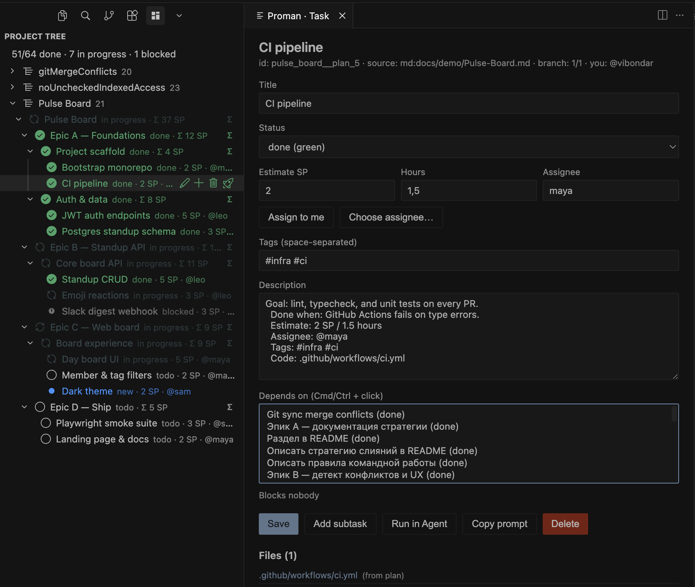

# Proman

**Language:** [English](./README.md) · [Русский](./README.ru.md)

Cursor / VS Code extension for managing development with a **task tree** stored in `.proman/`.

Local backlog, statuses, dependencies, Agent handoff, team Git sync, and a GitHub Issues bridge — without requiring Jira/Linear.

**Version:** 0.3.16 · [Changelog](./CHANGELOG.md)



---

## Who it’s for

Developers and small teams who want to:

- keep the plan next to the code (files in the repo);
- generate a development plan in Cursor **from a single template** and import it into the tree;
- **move a plan** between projects **with progress preserved** (export MD → import);
- hand tasks to Cursor Agent with context, statuses, and touched-file lists;
- sync via Git / GitHub Issues without a heavy PM stack.

---

## Quick start

1. Install the VSIX (`npm run install:cursor` or Install from VSIX) and **Reload Window**.
2. Enable the **proman** MCP server: Settings → **MCP** → find `proman` (or check `.cursor/mcp.json` in the project) → enable / Restart. Without this, the Agent cannot update statuses via `proman_*` tools.
3. Open a project folder → Activity Bar → **Proman**.
4. Import Markdown or add a root task.
5. (Optional) `Proman: Set Current User` — who you are on the team.
6. (Optional) `Proman: Enable Git Sync` / `Enable GitHub Issues`.

### Plan template in Cursor Rules

So Cursor **reliably** drafts plans in a format Proman can import, wire [`docs/templates/proman-tasks.md`](./docs/templates/proman-tasks.md) as a project rule.

1. Copy the template into your repo if needed, e.g. `docs/templates/proman-tasks.md`.
2. Create a Cursor rule:
   - Cursor Settings → **Rules** → Project Rules → **Add Rule**, or
   - file `.cursor/rules/proman-plan.mdc` at the project root.
3. Example rule body:

```markdown
---
description: Proman development plans — follow proman-tasks.md only
alwaysApply: true
---

# Development plan (Proman)

When the user asks for a roadmap, task plan, backlog, or planning MD for this project:

1. Read and follow `docs/templates/proman-tasks.md` (frontmatter `type: plan`, headings, `- [ ]` checkboxes, descriptions, Depends on, Estimate / Assignee / Tags / Code).
2. Write one `.md` file (e.g. `docs/plans/<name>.md`) in that template format.
3. Do not invent another task-list format — Proman parses this MD.
4. After generation, remind them to import via **Proman: Import Planning Docs**.
```

4. Reload Window (or start a new chat), then ask e.g. *“Draft a development plan using the Proman template”*.
5. Import the file: **Proman: Import Planning Docs**.

You can also paste the template path once in chat; a rule removes repetition and free-form output.

### One-off planning with Cursor

In chat, point at [`docs/templates/proman-tasks.md`](./docs/templates/proman-tasks.md), ask for a roadmap **using that template**, then **Proman: Import Planning Docs**.

Project data:

```
.proman/
  project.json      # meta, team, sync, github, trees[]
  trees/            # one tree per imported MD/plan
    <slug>.json
  tree.json         # flattened snapshot of all trees (MCP/compat)
  edges.json
  history.json
  comments/
  prompts/
  imports/          # copies of source MD
  proposals/
```

Each imported file becomes a **section** in the Proman panel. Statuses live in `trees/<slug>.json` across reopen; re-import/sync **merges** MD structure while preserving `status` / assignee / `changedFiles`. UI reads `trees/*`; flat `tree.json` stays in sync (including after MCP writes).

In a **team** repository, commit `.proman/` (do not add it to `.gitignore`).

### Portable plans with progress

You can **take a plan out of one workspace and restore it in another** without losing marked progress:

1. On a tree section in the Proman panel: **Export Tree to Markdown** (or context menu → export).
2. Save the `.md` — it includes hierarchy, descriptions, dependencies, assignee, and **current statuses** (`done` → `- [x]`, others via `Status: …` when needed).
3. In the target project: **Import Planning Docs** — the tree comes back with progress.

Useful for backups before experiments or sharing a roadmap without copying all of `.proman/`.

Removing a section: **Delete Task Tree** — warns that progress in that tree **will not be kept** (export first if you need it).

---

## Features

### Tree and statuses

- Tree panel: statuses `todo` / `new` / `in_progress` / `done` / `needs_rework` / `error` / `blocked`
- Multiple trees (sections) in one project — one per imported plan
- Icon colors, Σ SP on epics, assignee in the row
- Detail panel: description, estimates, tags, dependencies, assign, comments, history
- On **done** tasks: **created/modified files** list (click → open in IDE); own + done subtasks; source — MCP `files` on `done`, else fallback to `Code:` / `Tests:` from the description
- Tree search + path highlight
- **My tasks** — filter by `team.currentUser`
- **Export section to MD** with current progress; **delete tree** with confirmation

### Planning from Markdown

- Import roadmap / plan / checklists → tree
- Frontmatter `type: plan` → ids `plan_1`, `plan_2`, …
- Template: [`docs/templates/proman-tasks.md`](./docs/templates/proman-tasks.md) — attach via **Cursor Rules** (see above)
- Sample meta: [`docs/templates/proman-project.json`](./docs/templates/proman-project.json)
- Round-trip: export → MD → import **preserves progress** (checkboxes + `Status:` lines)

### Agent / Drive Mode

- **Run in Agent** — prompt with `PROMAN_TASK_RUN:<taskId>` under `.proman/prompts/`, opens Agent with the prompt **pasted** (you press Enter); `in_progress` (spinner) is set by the agent via MCP **only if the marker is still in the message**; on `done`, a `files` list
- **Add subtask** / **Delete** in task details use IDE dialogs (webview `prompt`/`confirm` are unavailable)
- **Drive Mode** — select the tree **section header** (not the first epic/task node) and start Drive: the agent walks that tree’s queue via MCP `proman_*`, starting from the first actionable task
- Tree structure changes only after your **Approve**
- On activation, writes `.cursor/mcp.json` (`proman` server); after install, **enable** it in Settings → MCP and restart MCP / Reload Window
- Do not edit `.proman/*.json` by hand — use UI / MCP tools only

### Team work (local)

- History in `.proman/history.json` (who changed status / assigned / when)
- Comments in `.proman/comments/<taskId>.json`
- Notification when a task is assigned to you

### Stage 1 — Git as backend

In `project.json`:

```json
"team": {
  "members": [
    { "username": "alice", "name": "Alice" },
    { "username": "bob", "name": "Bob" }
  ],
  "currentUser": "alice"
},
"sync": {
  "type": "git",
  "autoCommit": true,
  "autoPush": false
}
```

- **Pull** / **Push** buttons in the toolbar
- Auto-commit of `.proman/` on status change (`proman: @alice todo → done: …`)
- Commands: `Enable Git Sync`, `Configure Git Sync`
- Push after auto-commit always requires confirmation

#### Team Git sync · merge

Source of truth for the team backlog is the `.proman/` files in git (`project.json`, `trees/*.json`, …). Branch merging is ordinary **git merge / rebase**. Semantic JSON merge by `task.id` is available only via the manual **Resolve Proman Merge** command (see below).

- **Auto-commit** only touches `.proman/` (statuses / tree), not the rest of the repo.
- **Pull** changes the whole workspace (not only `.proman/`) — same as the warning before `git pull`.
- On **conflict markers** or invalid JSON under `.proman/` after Pull / Reload / startup, Proman shows a warning with paths and actions **Open file** / **Reload** / **Source Control**. Valid `trees/*.json` sections still load; conflicted files are **not** overwritten by heal-from-disk.
- If `git pull` fails with **CONFLICT**, the error is kept and a hint points to resolving markers (often under `.proman/`), then Reload.
- **Advanced:** command `Proman: Resolve Proman Merge` — semantic merge of two valid section JSON snapshots by `task.id` (optional base for deletes). Never runs automatically on pull. Rules: `docs/adr/semantic-tree-merge.md`.

**Team workflow** (fewer CONFLICT in `trees/*.json`):

1. **Pull before** changing statuses or importing MD.
2. **Short status commits**; do not mix code refactors with a mass tree rewrite in one commit unless necessary.
3. Prefer **one owner** of an active section (`trees/<slug>.json`) per sprint.
4. On **CONFLICT**: resolve markers in git → Reload; do not leave `<<<<<<<` in JSON.

### Stage 2 — GitHub Issues

```json
"github": {
  "enabled": true,
  "owner": "acme",
  "repo": "my-app",
  "createOnAdd": true,
  "closeToDone": true,
  "publicOnly": false
}
```

- Creating a task → Issue; link in description: `GitHub: #42`
- Closing an Issue → task `done`
- Auth: GitHub session in Cursor (`repo` or `public_repo`)
- Commands: `Enable GitHub Issues`, `Sync Closed GitHub Issues`
- Background sync on startup / every 5 minutes / after Pull

---

## Commands (main)

| Command | Action |
|---------|--------|
| Proman: Open | Focus the panel |
| Proman: Import Planning Docs | Import Markdown |
| Proman: Export Tree to Markdown | Export section to MD **with current progress** |
| Proman: Delete Task Tree | Delete section (progress is discarded) |
| Proman: Set Current User | `team.currentUser` |
| Proman: My tasks / All | Assignee filter |
| Proman: Assign Task | Assignment |
| Proman: Agent Drive Tree | Drive Mode |
| Proman: Run Task in Agent | Prompt + open Agent |
| Proman: Git Pull / Push | Sync `.proman/` |
| Proman: Resolve Proman Merge | Advanced: semantic merge of two section JSON snapshots |
| Proman: Enable Git Sync | Git backend |
| Proman: Enable GitHub Issues | Issues bridge |
| Proman: Sync Closed GitHub Issues | closed → done |

---

## Extension development

```bash
npm install
npm run build          # esbuild → dist/extension.js
npm test               # vitest
npm run test:coverage
npm run package        # → proman-x.y.z.vsix
npm run install:cursor # package + install into Cursor
```

- **F5** — Extension Development Host (`Run Proman Extension`)
- Entry: `src/extension.ts`
- Core (no UI): `src/core/*`
- MCP server: `mcp/server.mjs` → bundle `mcp/server.cjs`

### Tests

Unit tests: pathSafety, forest/security, taskFiles, MD export/import, handoff/Agent open, parsers, dependency/drive, history, GitHub links, projectMeta.

```bash
npm test
```

---

## UI language

The UI (commands, tree, task details, dialogs) follows the Cursor/VS Code **display language** (`Configure Display Language`). Currently: English and Russian. Docs: [README.md](./README.md) · [README.ru.md](./README.ru.md).

## Requirements

- Cursor or VS Code `^1.85.0`
- For Git sync: `git` on PATH, workspace is a git repo
- For GitHub Issues: signed in to GitHub in the IDE, access to the repository

---

## License

MIT — see [LICENSE](./LICENSE).
